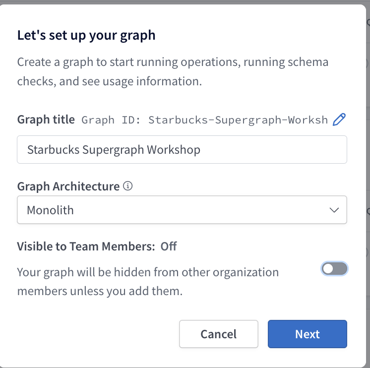
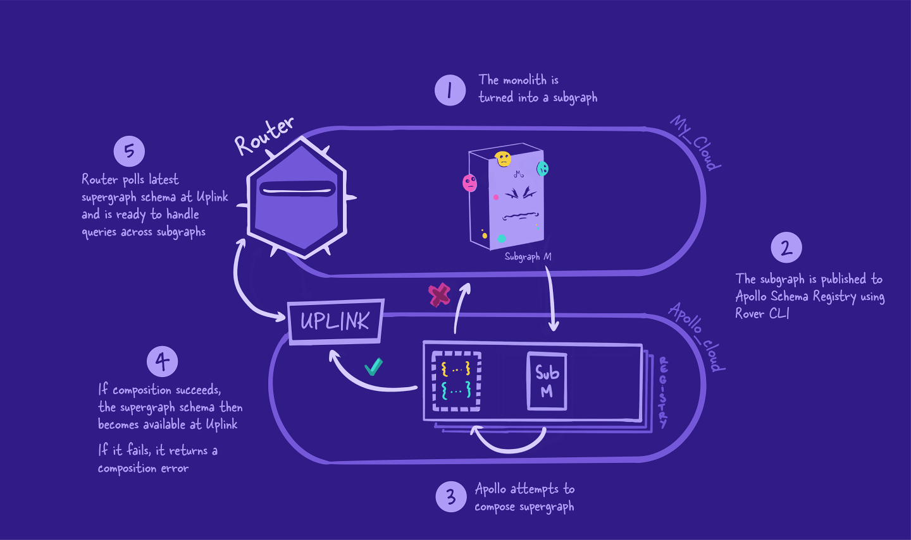
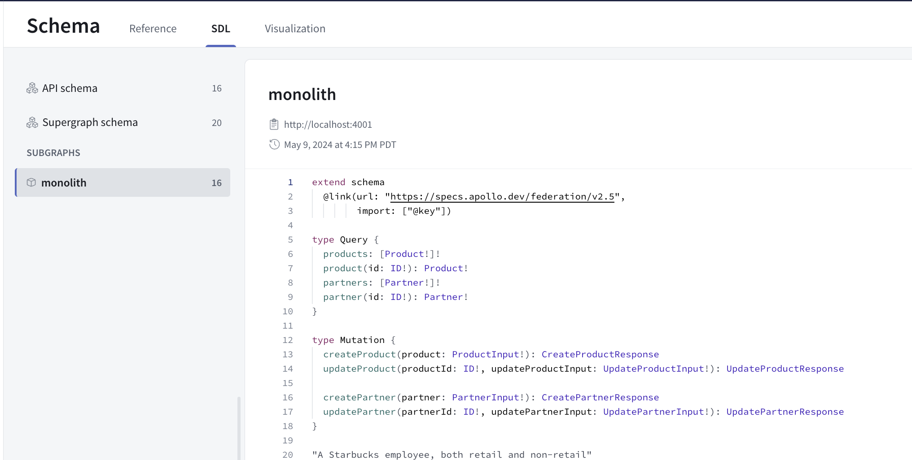
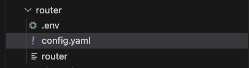
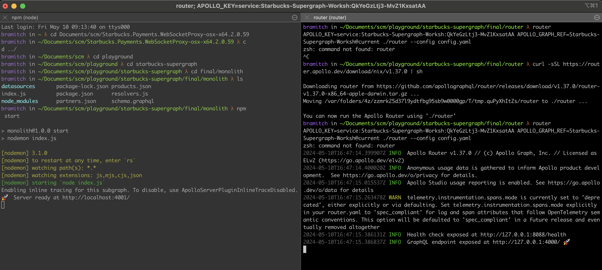

## Monolith Setup for GraphQL Workshop
This section of the workshop documentation focuses on setting up and running the initial monolithic GraphQL server, which uses static JSON files as its data store. This setup serves as the starting point for our workshop on migrating to a supergraph architecture.
### Prerequisites
Before starting, ensure you have the following installed and set up:
-  Node.js: Install the latest stable version of Node.js. Verify the installation using `node -v` to check the version.

-  Apollo Studio Account: Access to Apollo Studio (Enterprise Edition) is required, which can be accessed using Starbucks Single Sign-On (SSO). This tool will be used for testing and observing our GraphQL queries and mutations.

-  NPM Packages: Run `npm install` to install all dependencies necessary for the server to run.

### Running the Monolith

Our monolithic server uses static JSON files to simulate database interactions, simplifying the setup and focusing on GraphQL schema and resolver logic.

- Start the Server: Use `npm run start` to launch the GraphQL server. This command sets up the server on localhost:4000.

- Access GraphQL Playground: Open your web browser and visit http://localhost:4000. Here you can interact with the GraphQL API through the integrated Playground.
Supported Queries and Mutations

- Execute the following GraphQL operations to interact with the system. Examples are provided for both queries and mutations:
<details> <summary> <strong>Query 1: Get Partner By Id</strong> </summary>

```
query Partner($partnerId: ID!) {
  partner(id: $partnerId) {
    id
    email
    name
    position
  }
}
```
```
{
  "partnerId": "1"
}
```

</details> <details> <summary> <strong>Query 2: Get All Products</strong> </summary>

```
query Query {
  products {
    id
    name
    sku
    image
    price
    stock
    category
    availability
  }
}
```
No variables required.
</details> <details> <summary> <strong>Mutation 1: Create Partner</strong> </summary>

```
mutation CreatePartner($partner: PartnerInput!) {
  createPartner(partner: $partner) {
    success
    message
    partner {
      id
      email
      name
      position
    }
  }
}
```

```
{
  "partner": {
    "email": "test@user.com",
    "name": "Starbucks User 3",
    "position": "Barista"
  }
}
```

</details> <details> <summary> <strong>Mutation 2: Update Product</strong> </summary>

```
mutation UpdateProduct($updateProductInput: UpdateProductInput!, $productId: ID!) {
  updateProduct(productId: $productId, updateProductInput: $updateProductInput) {
    success
    message
    product {
      id
      name
      price
      sku
      image
      category
      availability
    }
  }
}
```
```
{
  "updateProductInput": {
    "price": 5.99,
    "stock": 10
  },
  "productId": "2"
}
```

</details>


## Deploying our monolith to Apollo Studio

### Setup Apollo Studio

1. Sign in to Apollo Studio: https://studio.apollographql.com/ using Starbucks SSO
2. Create a new graph 
 
3. Copy the `APOLLO_KEY`, `APOLLO_GRAPH_REF` to your `.env` file at the root level
4. Run the following to obtain all necessary modules to push to studio:
   
   ```npm install apollo-server apollo-server-express @apollo/federation @apollo/gateway ```

5. Install Rover CLI, which is Apollo's command-line interface for managing and maintaining graphs with GraphOS:
  
   mac: 
   ``` curl -sSL https://rover.apollo.dev/nix/latest | sh ```

   windows: 
   ``` iwr 'https://rover.apollo.dev/win/latest' | iex ```

6. Run the following, which will configure out API key and graph ref stored in the .env file for pushing via rover cli:  ```rover config auth```
  
7. Run the following to publish our schema: 
  
```rover graph publish Starbucks-Supergraph-Worksh@current --schema ./schema.graphql```

 


## Creating subgraphs and migrating to Supergraph
 

 First, the monolith graph will be converted into a subgraph. This means all of the schema's types, fields, and behavior will still be preserved and working as usual.

Next, we're going to publish the subgraph to the Apollo schema registry. This triggers composition. If composition fails, we get error messages we'll need to fix! If composition succeeds, Uplink will be updated with our new supergraph schema.

Then, the router will fetch this schema and be ready to handle incoming queries using this new schema!

This is only the start of our supergraph journey! After this process, we'll go back to the start and split off another subgraph from the monolith subgraph. After we make changes to a subgraph, we'll need to publish our subgraph schemas again and follow the flow.

### Terminology:

Composition: Composition is the process of combining a set of subgraph schemas into a supergraph schema. Composition has a few rules:
1. Multiple subgraphs can't define the same field on an object type, unless that field is shareable
2. A shared field must have both a compatible return type and compatible argument types across each defining subgraph 
3. If multiple subgraphs define the same type, each field of that type must be resolvable by every valid GraphQL operation that includes it

Entity: An object type that can resolve its fields across multiple subgraphs. Each subgraph can contribute different fields to the entity and is responsible for resolving only the fields that it contributes. 
An entity's `@key` must not include:
1. Fields that return a union or interface
2. Fields that take arguments


### Prerequisites

- `npm install @apollo/subgraph`
- We will need to specify that we would like to build a subgraph schema, but including the following in our monolith/index.js file:

At the top:
```
const { buildSubgraphSchema } = require('@apollo/subgraph');
```

and in `startApolloServer`:
```
const server = new ApolloServer({
  schema: buildSubgraphSchema({
    typeDefs,
    resolvers,
  }),
});
```
- Change the port to run on 4001 (line 19): ```  const port = 4001; ```
- Finally, to allow us to specify directives, we can use the following at the top of our schema: 
```
extend schema
  @link(url: "https://specs.apollo.dev/federation/v2.5",
        import: ["@key"])
```
- `npm start` and we can visit http://localhost:4001 to execute an example query!

## Publishing the subgraph

To publish the subgraph, we can utilize rover cli's `rover subgraph publish` similar to the `rover graph publish`:

```
rover subgraph publish Starbucks-Supergraph-Worksh@current \
  --schema ./schema.graphql \
  --name monolith \
  --routing-url http://localhost:4001
```

Ahh, we need to specify we are converting this into a supergraph! Luckily rover cli has a simple flag we can include to do so:

```
rover subgraph publish Starbucks-Supergraph-Worksh@current \
  --schema ./schema.graphql \
  --name monolith \
  --routing-url http://localhost:4001 \
  --convert
```


We can now verify that this subgraph has been successfully published to our newly converted federated supergraph! 

 


### Router Configuration

Start by creating a `router` folder at the root level.

Now we are going to configure the router. The router is a high-performance routing runtime for a supergraph, with efficient distribution of a single request to multiple subgraphs through a customizable processing pipeline.

The Apollo Router serves as the orchestration layer for your supergraph. It efficiently manages queries across multiple subgraphs, improving scalability and performance. Below, you'll find guidance on setting up and configuring the Apollo Router using command arguments, environment variables, and a YAML config file.

You can download it here: https://www.apollographql.com/docs/router/quickstart#manual-download or by running commands below:

Change directory into the newly created `router` folder and run the following command (or save the above into the router folder)

```
curl -sSL https://router.apollo.dev/download/nix/v1.37.0 | sh
```

Please also add a `.env` file in the router folder. The folder should look like:
 


We are going to keep the router configuration very simple, but you can view the full configuration spec here: https://www.apollographql.com/docs/router/configuration/overview/

Below is the router configuration:

```
include_subgraph_errors:
  all: true # Propagate errors from all subgraphs
```

### Running the Router

Now in a separate terminal, we will need to run the router:
In a new terminal, navigate to the router directory.

To start the router, we'll type in our APOLLO_KEY and APOLLO_GRAPH_REF. (Remember, you can find these variables inside of your .env file!) Then, start the router with ./router, and finally add the --config flag with the path to the config.yaml file.

(Windows):
Download the router from the release page. Set the env vars:

```
$env:APOLLO_KEY='<APOLLO_KEY>'
$env:APOLLO_GRAPH_REF='<APOLLO_GRAPH_REF>'
```
Then run:

```
.\router.exe --config .\config.yaml
```


(Mac):
```
APOLLO_KEY=<APOLLO_KEY> APOLLO_GRAPH_REF=<APOLLO_GRAPH_REF> ./router --config config.yaml
```

We should see output messages in the terminal, with our router running at 127.0.0.1:4000.

Remember port 4000 was where the original monolith GraphQL server was running? Now we've successfully replaced it with the router! Clients don't have to do anything extra to change their endpoints, they can keep querying as usual.

 


# Splitting up the monolith

## Subgraph planning

Deciding on where to start splitting off subgraphs can feel overwhelming. This is especially true if you have a large, complex graph, with multiple teams contributing and clients depending on its continued operation. We recommend keeping in mind a core principle of federation: incremental adoption. We'll break off the monolith subgraph's functionality one concern at a time.

Copy the `subgraph-template` folder and paste it in the root directoy. We will rename it to `subgraph-products`.

Modify the `index.js` file to update the `port` and `subgraphName`:
```
  const port = 4002; // TODO: change port number
  const subgraphName = 'products'; // TODO: change to subgraph name
```

Now we can `cd` into the `subgraph-products` folder, and run the following to start it up:

```
npm install
npm start
```

Visiting http://localhost:4002 should look familiar!

Great, now we have the base down! We need to start migrating entry points to our new subgraph schema. A good thing to know is that we don't have to do this all at once! We can first migrate the types, then the queries, then the mutations!

### Migrating types, interfaces, queries and mutations to subgraphs
Starting with the types, we can easily identify which types the partners subgraph should own!

We have a pretty easy understanding on which subgraph would own what. The monolith we will treat as our first subgraph, and it will contain all Partner logic. Let's start by moving the Product types, queries and mutations to the subgraph-products schema file:

We can copy and paste pretty much everything, it should look like (keep in mind the import at the top, which will come after):

```
extend schema
  @link(url: "https://specs.apollo.dev/federation/v2.0",
        import: ["@key"])
        
type Query {
  products: [Product!]!
  product(id: ID!): Product!
}

type Mutation {
  createProduct(product: ProductInput!): CreateProductResponse
  updateProduct(productId: ID!, updateProductInput: UpdateProductInput!): UpdateProductResponse
}

type Product {
  id: ID!
  name: String!
  sku: Int!
  image: String
  price: Float!
  stock: Int!
  category: ProductCategory!
  availability: Boolean!
}

type Partner @key(fields: "id") {
  id: ID!
  favoriteProduct: Product
}

enum ProductCategory {
  Beverage
  Food
  Merch
}

input ProductInput {
  name: String!
  sku: Int!
  image: String
  price: Float!
  stock: Int!
  category: ProductCategory!
}

input UpdateProductInput {
  name: String
  sku: Int
  image: String
  price: Float
  stock: Int
  category: ProductCategory
}

interface MutationResponse {
  code: Int!
  success: Boolean!
  message: String!
}

type CreateProductResponse implements MutationResponse {
  code: Int!
  success: Boolean!
  message: String!
  product: Product
}

type UpdateProductResponse implements MutationResponse {
  code: Int!
  success: Boolean!
  message: String!
  product: Product
}
```

And the monolith:

```
extend schema
  @link(url: "https://specs.apollo.dev/federation/v2.0",
        import: ["@key"])

type Query {
  partners: [Partner!]!
  partner(id: ID!): Partner!
}

type Mutation {
  createPartner(partner: PartnerInput!): CreatePartnerResponse
  updatePartner(partnerId: ID!, updatePartnerInput: UpdatePartnerInput!): UpdatePartnerResponse
}

"A Starbucks employee, both retail and non-retail"
type Partner @key(fields: "id") {
  id: ID!
  name: String!
  position: EmployeePosition!
  email: String!
}

input PartnerInput {
  name: String!
  position: EmployeePosition!
  email: String!
}

enum EmployeePosition {
  Barista
  Manager
  Engineer
  CEO
}

input UpdatePartnerInput {
  name: String
  position: EmployeePosition
  email: String
}

interface MutationResponse {
  "Similar to HTTP status code, represents the status of the mutation"
  code: Int!
  "Indicates whether the mutation was successful"
  success: Boolean!
  "Human-readable message for the UI"
  message: String!
}

type CreatePartnerResponse implements MutationResponse {
  "Similar to HTTP status code, represents the status of the mutation"
  code: Int!
  "Indicates whether the mutation was successful"
  success: Boolean!
  "Human-readable message for the UI"
  message: String!
  "The newly created product"
  partner: Partner
}

type UpdatePartnerResponse implements MutationResponse {
  "Similar to HTTP status code, represents the status of the mutation"
  code: Int!
  "Indicates whether the mutation was successful"
  success: Boolean!
  "Human-readable message for the UI"
  message: String!
  "The newly updated partner"
  partner: Partner
}

```


Now let's go to the resolvers, which again is a pretty simple copy and paste:

(subgraph-products)
```
const resolvers = {
  Query: {
    products: (_, __, { dataSources }) => {
      return dataSources.productsAPI.getProducts();
    },
    product: (_, { id }, { dataSources }) => {
      return dataSources.productsAPI.getProduct(id);
    },
  },
  Mutation: {
    createProduct: async (_, { product }, { dataSources }) => {
      return await dataSources.productsAPI.createProduct(product)
    },
    updateProduct: async (_, { productId, updateProductInput }, { dataSources }) => {
      return await dataSources.productsAPI.updateProduct(productId, updateProductInput);
    },
  },
  Partner: {
    favoriteProduct: (partner, _, { dataSources }) => {
      return dataSources.productsAPI.getFavoriteProduct(partner.id);
    }
  },
  Product: {
    availability: (product, _, { dataSources }) => {
      return dataSources.productsAPI.getProductAvailability(product.id);
    }
  }
};

module.exports = resolvers;

```

(monolith aka subgraph-partners) 
```
const resolvers = {
  Query: {
    partners: (_, __, { dataSources }) => {
      return dataSources.partnersAPI.getPartners();
    },
    partner: (_, { id }, { dataSources }) => {
      return dataSources.partnersAPI.getPartner(id);
    },
  },
  Mutation: {
    createPartner: async (_, { partner }, { dataSources }) => {
      return await dataSources.partnersAPI.createPartner(partner)
    },
    updatePartner: async (_, { partnerId, updatePartnerInput }, { dataSources }) => {
      return await dataSources.partnersAPI.updatePartner(partnerId, updatePartnerInput );
    },
  },
};

module.exports = resolvers;


```


### Publishing the subgraph schemas

Now we are ready to publish our subgraph schemas!

```
rover subgraph publish <APOLLO_GRAPH_REF> \
    --schema ./subgraph-partners/schema.graphql \
    --name partners \
    --routing-url http://localhost:4002
```

```
rover subgraph publish <APOLLO_GRAPH_REF> \
    --schema ./subgraph-products/schema.graphql \
    --name products \
    --routing-url http://localhost:4003
```


### Testing our old queries and mutations
Examples are provided for both queries and mutations:
<details> <summary> <strong>Query 1: Get Partner By Id</strong> </summary>

```
query Partner($partnerId: ID!) {
  partner(id: $partnerId) {
    id
    email
    name
    position
  }
}
```

```
{
  "partnerId": "1"
}
```
</details> <details> <summary> <strong>Query 2: Get All Products</strong> </summary>

```
query Query {
  products {
    id
    name
    sku
    image
    price
    stock
    category
    availability
    isExclusive
  }
}
```

No variables required.
</details> <details> <summary> <strong>Mutation 1: Create Partner</strong> </summary>

```
mutation CreatePartner($partner: PartnerInput!) {
  createPartner(partner: $partner) {
    success
    message
    partner {
      id
      email
      name
      position
    }
  }
}
```

```
{
  "partner": {
    "email": "test@user.com",
    "name": "Starbucks User 3",
    "position": "Barista"
  }
}
```
</details> <details> <summary> <strong>Mutation 2: Update Product</strong> </summary>

```
mutation UpdateProduct($updateProductInput: UpdateProductInput!, $productId: ID!) {
  updateProduct(productId: $productId, updateProductInput: $updateProductInput) {
    success
    message
    product {
      id
      name
      price
      sku
      image
      category
      availability
    }
  }
}
```
```
{
  "updateProductInput": {
    "price": 5.99,
    "stock": 10
  },
  "productId": "2"
}
```
</details>

And we've successfully converted our monolith to a supergraph with subgraphs!